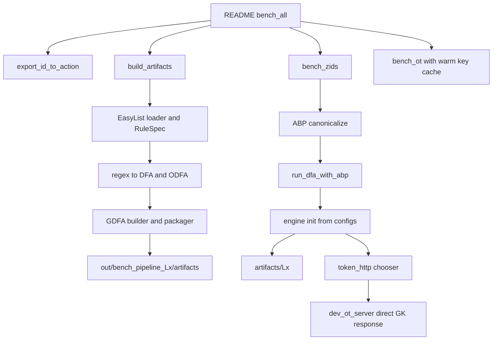

# ZIDS paper 復現一致性審查

> Historical audit of the legacy implementation. See [source recovery](../README.md) and [current implementation status](../../docs/IMPLEMENTATION_STATUS.md).

審查日期：2026-10-02。對象為本次收到的工作目錄實際內容，包括尚未提交的變更與既有產物。Git HEAD 為 `4ad62fe76cfca8a021b7e790ae212ca252e29fa5`，這個 commit 本身不能完整表示受審版本。

**結論：這個 project 目前不能視為 paper 所述安全二方 ODFA protocol 的正確復現。差異遠超過把測試集改成 EasyList。** 專案確實包含 regex/NFA/DFA 編譯、部分最小化、依目的 state 做字元分組、加密轉移表、HTTP chooser 及 benchmark。但 paper 的核心安全構造沒有接起來，而且現有 EasyList pipeline 存在可以重現的功能性錯誤。現存效能數據也不足以支持與 paper 的比較。

這次只新增 `audit/` 審查資料，不修改原本的實作、設定、規則或 benchmark 結果。附件中的協定敘述被當作比較依據，不當作對助理下達的操作指令。

## 閱讀入口與覆蓋範圍

| 文件 | 用途 |
| --- | --- |
| [source_review.md](source_review.md) | 70 份原始 Python 檔案逐檔結論，包含未使用、空白及已失效的分支 |
| [file_inventory.csv](file_inventory.csv) | 原始 321 個專案檔案逐檔分類、大小、檢查方式與問題 ID |
| [data_review.md](data_review.md) | 24 份 GDFA、12 份設定、15 份規則檔、10 組 dataset、22 份 CSV 的逐份表格 |
| [evidence.json](evidence.json) | 18 組實際執行的反例與資料交叉檢查 |
| [reproduce_findings.py](reproduce_findings.py) | 可重跑的反例程式，HTTP probe 使用本地 stub，不對真實 server 發送請求 |
| [module_checks.json](module_checks.json) | 70 份原始碼的語法檢查及 68 份安全匯入檢查 |
| [existing_tests.json](existing_tests.json) | 專案既有非空測試程式的執行結果 |
| [container_integrity.json](container_integrity.json) | 對所有 GDFA body 完整串流重算 SHA256 的結果 |
| [supplementary_files.json](supplementary_files.json) | 歷史 id/action 表、clean files、文字輸出的補充檢查 |
| [bytecode_inventory.json](bytecode_inventory.json) | 32 份 `.pyc` 的 header 與 source 對應檢查 |
| [file_snapshot.json](file_snapshot.json) | 審查開始時的原始檔案清單與小檔 SHA256 |
| [verification.json](verification.json) | 321 檔大小及 290 份原始小檔 hash 比對，沒有變更，報告引用與覆蓋檢查通過 |

原始 321 個專案檔案合計 167,715,502,752 bytes，約 156.2 GiB。所有第一方 Python 原始碼都讀過，並追蹤其呼叫端與消費端。所有 GDFA 容器都檢查 header、body 長度、sidecar 維度、permutation、AID 分布及完整 body hash。規則、dataset、JSON、CSV 與文字輸出均完整讀取。

範圍不包含對 `.git` 物件資料庫或 `.venv` 第三方套件原始碼逐行做安全審查。Git 追蹤了 1,817 個 `.venv` 檔案，這些屬於環境及依賴，不是本專案的 protocol 實作。`.pyc` 是衍生快取，檢查其存在及來源，沒有把反編譯歷史 bytecode 當作現行原始碼。也沒有重新生成全部約 156 GiB 的歷史產物。

以下「已重現」表示有執行證據。「程式確認」表示由目前可到達的程式邏輯直接確認。「歷史產物異常」表示現有檔案不一致，但無法憑這個工作目錄還原當時完整命令、程式版本與環境。沒有宣稱這是一份形式化安全證明。

## Paper 真正要求的 protocol

依據使用者提供的 16 頁 PDF (user-supplied PDF outside this repository)，重點為 §4、§5.1–5.6、§6.1–6.5。以下頁碼指附件頁面上的 1–16，不是期刊正式排版頁碼。[期刊來源](https://academic.oup.com/comjnl/article-abstract/57/4/494/407921) 可核對論文身分。

Server 的秘密是 DFA，client 的秘密是長度 n 的輸入字串 X。雙方知道 n、state 數 Q、alphabet 大小、安全參數，以及 `outmax`、`cmax`。這些是協定允許的 public leakage，不包含整份 transition partition、全 state 的 attack ID、完整 permutation 或所有 key。

字元群組先對每個 state 依相同 destination 分組，再把各 state 產生的群組集合全域去重形成 C。對字元 x，`C_x` 是 C 裡面所有包含 x 的群組。`outmax` 是單一 state 最多的 outgoing groups，`cmax` 是所有 x 的 `|C_x|` 最大值。**某個 byte 在單一 state 恰好屬於一個 group，不代表 cmax 等於 1。**

Paper 的 DFA matrix 有 n 個輸入位置，每個位置有 Q 個 state cell。一個 cell 裡面有 `outmax` 個 entry。每個輸入位置有獨立 permutation、character-group keys 與每個 state 的 pad seed。中間位置的 entry 是下一個 permuted state index、下一個 cell 的 pad seed，以及 k 個驗證用零位元，長度 `k' = 2k + ceil(log2 Q)`。entry 先用 character-group key XOR，加上隨機 dummy entries 並打亂 entry 順序，整個 cell 再用其 pad 的 PRG output 遮罩。最後位置以輸出代替繼續轉移的資訊。

Client 對每個輸入位置做一次 1-out-of-256 OT，choice 是 byte，而取得的 message 是該 byte 對應的 `cmax` 個 group keys，包含補齊與排列。Client 只拿到起始 state index 和起始 pad，利用 OT keys 與 pad 鏈逐步走 n 次，只在最後取得輸出。它不需要把目前 state 或選到哪個 transition 傳給 server。

§5.6 的安全主張以 PRG 與適當安全、可平行使用的 OT 為前提，對惡意 client 有 full security，對惡意 server 主張 client input privacy。這並非承諾惡意 server 必須提供正確規則或正確答案，也不是未知攻擊自動學習系統。

編譯、DFA 合併與最小化可以重用。每次 protocol execution 的 garbling 和相關 key/pad 隨機性則需要重新準備。可預先 offline 計算，並不表示同一份 garbling 可讓 client 無限制重複查詢。Paper 的基本 protocol 是一輪，OT extension 可以增加一輪。§6.1 另外實作 Naor–Pinkas OT、OT extension、OT precomputation，以及 server 逐輸入位置生成並傳送矩陣列的記憶體最佳化。

附件 pseudocode 有少數索引筆誤，例如輸出解密段 j/z 的使用，以及 OT answer 段 z' 的位置。復現應依上下文與維度修正，不能把明顯筆誤當作應照抄的規格。本文判斷不依賴這些筆誤。

## 協定逐項對照

| Paper 要求 | 現有實作 | 判定 |
| --- | --- | --- |
| Server 私有 DFA，client 私有輸入 | client 得到 row alphabet、AID 表、permutation 及可導出所有 keys 的 master | 不符合 |
| 正確 regex/NFA/DFA 編譯 | 有基本演算法，但 regex 子語法有多個反例 | 部分完成 |
| Snort content/pcre 處理及合併 | 改為 EasyList adapter，沒有等價完整 Snort parser | 明確替換 |
| 保持 output 的 DFA minimization | tagged minimization 有實作，之後卻壓成 min ID | 中間正確，後續丟資訊 |
| 按相同 destination 做 group | 每 state 有實作 | 此局部概念符合 |
| 全域 C、C_x、cmax | 只有每 row 的 byte-to-col 表，cmax 固定 1 | 不符合 |
| n × Q DFA matrix | Q 個 state rows，沒有 n 軸 | 不符合 |
| 每位置獨立的秘密 permutation | 一個 global permutation，主入口關閉，仍寫入 public header | 不符合 |
| 每位置 group keys | row-only 或 row/col keys | 不符合 |
| next index + next pad + 0^k | next index + AID + padding，沒有 next pad | 不符合 |
| entry group-key XOR 加上整個 cell PRG | 單一 entry 的 PRG XOR | 不符合 |
| dummy 為不可辨識的隨機 entry | 可解碼的 dst0/AID0 dummy edge | 不符合 |
| cell 內 entry shuffle | 沒有 | 不符合 |
| 每 byte 1-of-256 OT，取 cmax keys | HTTP 明文 row/col 換一把 row key | 不符合 |
| client 只解 input path | 132/132 小型產物 entries 可離線解開 | 已證偽 |
| OT receiver privacy | dev HTTP 明文，另有 base OT 惡意 sender 反例 | 已證偽 |
| OT sender privacy | 1-of-m ciphertext 洩漏未選 messages 的 XOR 關係 | 已證偽 |
| 只得最終 output | 每個 prefix 收集 AID，部分 API 支援提前停 | 不符合 |
| 每次執行新鮮 garbling/keys | static artifact、master 及跨字串 cache | 不符合 |
| 真正 OT extension / precomputation | 名稱 iknp 仍執行 DirectOT，無 Beaver online correction | 未實作 |
| server 只留一個 matrix row | packager 把所有 rows list 再 join | 不符合 |
| 正確功能再比較 online/offline 成本 | 4,400 筆全 NOMATCH，且 build 與 eval 路徑不同 | 無有效比較基礎 |

## 實際啟動路徑

README 啟動的是 `src.server.ot.dev_ot_server`。它和獨立的 `src.common.ot` 沒有接成同一個 protocol。



`gdfa_evaluator`、`ot_pad_oracle`、`ot_client`、`handler`、`ot_response_builder`、`param_setup` 形成的是其他版本的介面或測試路徑。它們彼此也有匯入及 method 簽名不相容，不能把每個元件名稱拼在一起就視為 paper 全流程已存在。

## P0：直接推翻核心安全主張

P0 在本報告表示無法成立 paper 核心 privacy/security 主張，不是在替專案套用外部漏洞評分標準。

### P0-01：GDFA 構造已經是另一種協定

位置：`src/server/offline/gdfa_builder.py:91`、`:185`、`:212`、`:243`，`src/common/odfa/matrix.py`，`src/client/online/engine.py:219`。

`build_gdfa_stream` 的輸入沒有 n。它遍歷 DFA states，為每 row/col 準備 seed，用 PRG XOR 包住 transition 的 next state 和 AID。沒有 input-position dimension、下一位置 pad、group-key 的 inner encryption、每位置 state permutation，或每 cell 的 entry shuffle。

所以它儲存的是一份可反覆走訪的加密 transition table。Paper 依賴「只有到達某 cell 才知道其 pad」以及「在該位置只能拿到輸入 byte 所需 group keys」限制 client 的知識。這兩個條件在這個構造中都不成立。

這不是 endian 或少一個迴圈的局部錯誤。即使把 HTTP chooser 換成安全 OT，剩下的 table 結構也不會自動取得 paper 的安全性。必須重新建立 position、state、entry 三個維度及兩層 garbling。

### P0-02：README 路徑沒有 oblivious transfer，client 可解整份 DFA

位置：`src/client/online/token_http.py:47`，`src/server/ot/dev_ot_server.py:37`，`src/client/online/chooser_master.py:45`，`src/client/online/engine.py:28`。

HTTP request 直接含有 `row`、`col`、`k_bytes`、`master_hex`、`sid`。Server 忽略 col，以 row 和 master 導出 GK，並把 GK 直接回傳。`/ot/start` 忽略 request body，沒有建立帶 choice 限制的 cryptographic state。TLS 也不能解決 server 本身看到 choice 的問題。

Client 設定持有 master，所以連 server 都不需要。已用 `configs/engine_init_small.json` 與 `artifacts/small/gdfa.bin` 完整解開 **132/132 個 entries**，所有 next-state 值域及高位 padding 均合理，真實網路請求數是 0。證據為 `actual_artifact_decryption`，報告與 probe 不輸出 master 值。

即使刪掉 client master，同一 row 的所有 col 仍共用 GK，server 又接受任意 row request，無法提供 paper 所需的受限 key access。另一路 `engine._OTRowChooser` 會取得完整 row payload，`LocalTrivialOTChooser` 甚至直接接觸 server 的 seed。這些適合明確標成測試替身，不能算 secure OT。

Client 同時取得 `row_alph.bin` 的每 state 字元分組、`row_alph.json` 的每 state degree、`row_aids.bin` 的全部接受狀態 ID，以及完整 permutation。這比 paper 允許的 Q、outmax、cmax、最終 output 多得多。

### P0-03：獨立 1-of-m OT 洩漏未選 messages 的關係

位置：`src/common/ot/ot_1ofm.py:81` 與 `:148`。證據：`ot_parity`。

目前 message t 的遮罩是各個 choice bit 對應 PRF output 的 XOR，PRF domain 只有 label、bit position 和 sid，沒有把完整 t 納入。同時考慮兩個 bit 的 00、01、10、11，四個遮罩的每項都出現偶數次，因此全部抵消。

```text
CT00 XOR CT01 XOR CT10 XOR CT11
  = M00 XOR M01 XOR M10 XOR M11
```

Probe 使用四個不同的 16-byte synthetic messages，實際得到兩側都等於重複的 `07`。**不需要做任何一次 base OT，就能取得未選明文的非平凡關係。** 這已经違反 sender privacy，並非只有惡意 receiver 或錯誤輸入才會觸發。1-of-256 wrapper 也繼承同一問題。

這套 reduction 必須改成有正確安全依據的 construction。只讓功能測試繼續選對一筆不足以證明修復，單獨加一個 domain field 也不應直接宣称整套 malicious security 成立。

### P0-04：base OT 的 receiver 沒有驗證 sender 群元素

位置：`src/common/ot/base_ot2/ddh_ot.py:54`。證據：`base_ot_malicious_sender`。

`DDHGroup` 提供 subgroup 檢查，sender 對 B 有使用，但 receiver 對收到的 A 沒有使用。惡意 sender 選 A = p−1，當 choice 為 0 時 B 在 q-order subgroup，choice 為 1 時 B 落在另一個 coset。Sender 對公開 B 計算 `B^q mod p` 就能分辨兩種 choice。

Probe 對 choice 0 與 1 都成功推回原始 choice。這直接衝突於 paper 對惡意 server 的 client input privacy。至少要完整驗證收到的群元素，並重新檢查所選 OT construction 的安全模型與多次組合，不能因 sender 端已有部分驗證而忽略 receiver。

## P1：協定與功能正確性錯誤

### P1-01：cmax 定義錯了，全域群組沒有建立

位置：`dfa_optimizer/char_grouping.py:57`、`sparsity_analysis.py:58`、`common/odfa/params.py:65`、`client/io/row_alph_loader.py:57`。相對路徑以 `src/server/offline` 或 `src` 為前綴。

每 state 將 byte 分到唯一 outgoing column，是局部分組的合理結果。但 paper cmax 是同一 byte 跨全域不同 character groups 的最大隸屬數。程式把兩者混在一起，硬回傳 1。

已重現 pattern `ab` 的 DFA 有 4 個去重後全域群組，paper 定義的 cmax 是 2，實作卻建議 1。`cmax <= alphabet_size` 也不是一般可成立的限制。只增加 CLI 的 cmax 無法修復，因為傳输布局與 client evaluator 都沒有真正處理全域 `C_x` 的 keys。

### P1-02：entry/cell 寬度混淆，outmax 被乘了兩次

位置：`common/odfa/params.py:114`、`common/odfa/packing.py:30`、`server/offline/gdfa_builder.py:116`。

`make_packing` 正在計算 paper 意義的整個 cell pad 長度 `outmax * kprime_bits`。但 `plan_cell_format` 把它當作單一 transition entry 的長度，builder 又把 `outmax` 個這種 entry 接成一 row。結果 body 大小是 `Q * outmax^2 * kprime_bytes`，而且仍缺 paper 的 n 維度。

小例中 outmax=3、kprime=128 bits，實作的一 entry 是 48 bytes，一 state row 是 144 bytes。outmax=256、kprime=256 bits 時，一 entry 8192 bytes，一 state row 2,097,152 bytes。這解釋了多份 pipeline 產物異常龐大，並非 paper sparse GDFA 的正常空間公式。

`SecurityParams.kprime_bits` 也獨立設成固定值，沒有依 `2k + ceil(log2 Q)` 推導。最後 byte alignment 可以透過明確格式處理，但不能直接少掉 next-pad 和驗證 bits。

### P1-03：builder 和兩個 evaluator 的格式不相容，錯 key 也可能被接受

位置：`server/offline/gdfa_builder.py:23`，`client/online/engine.py:111`、`:143`，`client/online/gdfa_evaluator.py:50`、`:135`，`client/online/ot_pad_oracle.py:66`。

Builder 用 little-endian bit packing，把 AID 緊接在 `ns_bits` 後面。現行 engine 卻先把 state 補成整數個 bytes，再從下一個 byte 讀 AID。當 state bits 不是 8 的倍數時，欄位邊界不同。實際 probe 的 `(next=1, aid=7)` 被現行 decoder 讀成 `(1,0)`，舊 decoder 則讀成 `(0,29696)`。

現行 decoder 只檢查遮罩後的 next row 是否在範圍內，沒有檢查 paper 要求的 k 個尾端零。Probe 的非零 padding 仍被接受為 `(0,65535)`。隨機錯解資料在第一個 layout 下通過 row 檢查的機率約是 `Q / 2^ceil(log2 Q)`，通常很高，並非密碼學可忽略機率。`_open_cell` 又嘗試不同 key/pad/index 模式，首次碰巧落在範圍內就把猜測固定下來。

舊 evaluator 的 PRG domain 是 `PRG|GDFA|cell`，目前 builder 是 `ZIDS|CELL`。同一 seed 展開的 pad 不同，已重現。因此既有舊格式 synthetic evaluator test 通過，不能作為目前 builder/evaluator 的互通證明。

### P1-04：permutation 既洩漏、未使用，也存在方向與取樣錯誤

位置：`server/offline/gdfa_builder.py:198`，`tools/build_artifacts.py:632`，`client/io/gdfa_loader.py:146`，`common/odfa/permutation.py:25`。

Paper 需要每輸入位置獨立的秘密 permutation。實作只有一份，寫到 public header，而主入口固定 `permute=False`。24 份現存 GDFA 中有 23 份是 identity permutation，包含目前 11 份有效 engine config 指向的產物。例外是較舊的 `artifacts/gdfa.bin`，它具有非 identity 的全域 permutation，也沒有 row_aids sidecar。主 benchmark 因而避開了非 identity 映射分支。

Builder 的 public permutation 定義是 new state 到 old state。`inv_permute` 卻使用它的 inverse，把 old-to-new 當成 new-to-old 回傳。Probe 給 `[2,0,1]` 時，新 row 0 應映到舊 state 2，實際回傳 1。

另外，取樣用 16-bit random modulo，存在 modulo bias，state 超過 65536 時還會限制可選範圍。inverse helper 也只檢查值域而沒有檢查唯一性。這些要分別修正，不能只打開 permute flag。

### P1-05：AID 代表什麼，在不同階段並不一致

位置：`rules_to_dfa/regex_to_dfa.py:447`、`chain_rules.py:223`、`:267`，`gdfa_builder.py:238`，`client/online/engine.py:234`。

DFA-to-ODFA 把 source state 的 AID 寫在 edge 上。Builder 只有 source AID 為 0 才改用 destination AID，因此一個 transition 的 AID 有時代表出發 state，有時代表目的 state。engine 又先讀 destination 的公開 row_aids，沒有時才讀 cell AID。sidecar 可能掩蓋 cell 格式及標記錯誤，但不是正確的修復。

Tagged minimization 有保留同時命中的 tag set，這部分是合理設計。但轉 ODFA 時使用 `min(tags)`，把多個命中壓成單一最小 ID。對 EasyList 的 ALLOW-over-BLOCK policy，單靠最小 ID 不成立。Probe 用相同 pattern 的 BLOCK ID 1 與 ALLOW ID 2，正確 tag set 是 `{1,2}`，轉換後只有 1，最終錯判 BLOCK。

Paper 可以定義單一最終 attack output，但那不等同於任意丟棄 exception 語義。engine 現在每個 prefix 累積 AID，舊 API 還能提前停止，也不同於 paper 固定走完 n 步只揭露最後 output。若希望保留多規則結果或 ALLOW 優先，必須先定義輸出函數，再編譯到 final output。

### P1-06：regex compiler 不只是支援較少語法，部分已接受語法會算錯

位置：`rules_to_dfa/regex_to_dfa.py:103`、`:145`、`:154`、`:280`、`:326`。證據：`regex_semantics`。

| 情境 | 應有結果 | 實際結果 |
| --- | --- | --- |
| anchored `a{2}` 配 `aaa` | False | True，exact repeat 被當成下限 repeat |
| ignore-case `[^a]` 配 `a` | False | True，取補集與 case folding 次序錯 |
| `\d` 配 `5` | True | False，escape 被當成字面字母 |
| `^abc$` 配 `abc` | True | False，anchor 被當字元 |
| ignore-case `\x41` 配 `a` | True | False，hex escape 未等效 case folding |
| search `abc` 配 `abcZ` | True | final-state False，只有前置 wildcard，沒有後綴 search 語義 |
| 不合法的 `a{3,2}` | 拒絕 | 接受 |
| 傳入 `re.IGNORECASE` | 轉換或清楚拒絕 | AttributeError，預期的是另一種 RegexFlags |

還有 Unicode 直接 `ord & 255` 造成不同字元碰撞，noncapturing group 需要 sanitizer 補救，lookaround/backreference 沒有正確語義。對不支援語法應明確拒絕並保留來源，不能靜默改成另一個 regex。

engine 的 prefix hit 收集能掩蓋部分後綴 search 問題，但代價是改變輸出函數與 leakage，不能用它證明 compiler 與 paper 的 final-output DFA 等價。

### P1-07：EasyList 規則與 payload 使用不同 alphabet 表示

位置：`server/io/easylist_loader.py:60`，`common/abp_canonicalize.py:134`，`common/urlnorm.py:68`，`client/online/engine.py:210`，`tools/bench_zids.py:68`。

`||ads.example^` 被轉成需要 `://` 的 regex。但 ABP canonicalization 移除 scheme，加入 host/separator control characters。legacy `canonicalize` 也移除 scheme。規則端沒有編譯成相同的 encoded alphabet。

合成 probe 上，`https://ads.example/` 用轉換後 regex 能命中，用 ABP payload 則不能。現有 `artifacts/small` 上也重現，不依賴重新編譯產物。

| 輸入 URL | 直接呼叫 `_run_bytes` | 公開 `run()` | ABP payload |
| --- | --- | --- | --- |
| `https://0cf.io/` | `[1]` | `[]` | `[]` |
| `https://adv.gg/` | `[2]` | `[]` | `[]` |
| `https://unmatched.example/` | `[]` | `[]` | `[]` |

這裡的 direct bytes 是刻意跳過正規化的診斷入口，不是建議把 private method 當作正式 API。它用來隔離並證明正規化確實破壞了命中。

### P1-08：EasyList adapter 沒有實作 ABP 規則語義

位置：`server/io/easylist_loader.py:60`–`:84`，`common/abp_canonicalize.py`。

`*` 被 escape 成字面星號，單邊 `|` anchor 被當字元，`^` 只在簡單 domain 尾端特殊處理並限縮成 slash 或字串結尾，非預設 port 的合法 URL 不命中。`$script`、`domain=`、third-party、match-case 等 options 被丟棄，`/regex/` 與 cosmetic filters 也沒有完整分類。

已重現 `/ads/*` 不匹配 `/ads/banner.js`，`|https://ads.example/` 不匹配該 URL，`||ads.example^` 不匹配 `https://ads.example:8443/`。帶 `$script` 的 rule 會退化為不受 type 限制的 domain rule，即使 payload 有 type metadata 也沒有對應的 compiler。

這些符號和 options 在 ABP 裡有定義，不是可任意去除的裝飾。比較依據為 [ABP 官方規則說明](https://help.adblockplus.org/adblock-plus-help-center/how-to-write-filters) 與 [官方語法速查](https://adblockplus.org/filter-cheatsheet)。本報告只用它們界定 adapter 的預期語義，沒有把完整 ABP 等同於 regular-language protocol 必須原生支援的全部功能。

把 dataset 換成 EasyList 本身可以是合理變體。前提是明定可支援的 network-filter 子集合、正確拒絕其餘語法，並維持 rules 與 inputs 的同一編碼與輸出 policy。目前不滿足這些條件。

### P1-09：action、flags、rule ID 在 pipeline 中流失

位置：`server/io/rule_loader.py:73`，`tools/build_artifacts.py:139`，`tools/export_id_to_action.py`，`client/online/engine.py:380`，`tools/run_dfa_with_abp.py`。

EasyList loader 一開始可以區分 `@@`，轉成 RuleSpec 時卻丟 action/label。Sanitizer 對缺 action 的規則預設 BLOCK。RegexFlags 物件又被轉為 int 0，原本 ignore-case 變成 case-sensitive，其他 flags 也可能流失。移除 inline flags 的 sanitizer 本身同樣會改變匹配語義。

Prefilter 先丟規則，sanitize 再把 survivors 從 1 重新編號，id_to_action exporter 卻按另一套原始行過濾邏輯編號。Probe 的原 ID 2 變成 1。多檔載入每檔又從 1 開始，兩條規則的 IDs 是 `[1,1]`。engine 內部 regex fallback 用 zero-based enumerate，第一條規則回傳 0，與其他分支的不命中 sentinel/one-based ID 慣例衝突。

未知 ID 的處理也不同，library `abp_decide` 回 BLOCK，CLI 回 NOMATCH，已用 ID 999 重現。這會讓同一條命中在不同入口呈現不同 verdict。

### P1-10：README pipeline build 的產物不是接著 eval 的產物

位置：`tools/bench_all.py:156`，`tools/build_artifacts.py`，`configs/engine_init_L*.json`，`server/online/handler.py`。

README 指定新 artifact 存到 `out/bench_pipeline_Lx/artifacts`。Engine config 固定指向 `artifacts/Lx`，bench_all 沒有把新路徑寫進當次 config。因此 offline build 與 online benchmark 不是同一份 GDFA。

即使手動改 config 路徑也還不夠。主 build command 沒指定能與 chooser 對應的 master/key derivation，`build_gdfa_stream` 預設用 random seeds，主工具沒有輸出可供 online chooser 使用的匹配 key material。Probe 連續兩次 build 的 ciphertext 不同，這是隨機性正常現象，但其 key lifecycle 沒有接到 online。

另一路 manifest-based handler 也不能直接補上，因為主 builder 不產生它依賴的完整 manifest。修復應由單一 build manifest 綁定 rules hash、compiler version、params、GDFA、alphabet/output sidecar 和 server-only key material，再讓 evaluator 明確讀同一個 build。

### P1-11：session ID 並沒有提供每次執行的新鮮 keys

位置：`server/online/session_manager.py`，`common/odfa/seed_rules.py`，`client/online/engine.py:89`，`tools/bench_ot.py:49`。

已建立兩個不同 session，觀察到 master 模式的 key tables 完全相同。Derivation 沒有把 sid 或 input position 納入。Random session keys 則又沒有與既有 static artifact 綁定。HTTP dev server 不實際建立 session state。

engine cache 以 `(row,col)` 為 key，跨不同 input 保留。反覆查詢不同字串可以累積更多 transition 知識，與 paper 單次 garbling 的安全論證不符。即使把 sid 拼入某個函式，也必須同步更新 garbling、OT messages、pad chaining 與使用次數模型，不能局部改 label 就算完成。

### P1-12：benchmark 的正確性與測量邊界都不成立

位置：`tools/bench_zids.py`，`tools/run_dfa_with_abp.py:119`，`tools/bench_ot.py:49`，`tools/bench_all.py`。證據：`benchmark_reinitialization`、`data_and_artifacts`。

已逐列讀取 22 份 CSV，共 4,400 列。12 份 engine CSV 的 2,400 列全部 NOMATCH，10 份 regex CSV 的 2,000 列也全部 NOMATCH，所有 agree 欄都是空白。10 組 domain dataset 每組 200 個 URL 都符合該組的某條 domain block rule，沒有 negative、exception 或 request context 的有效覆蓋。因此全 NOMATCH 不是正確率高，而是明顯反例。

`bench_zids` 每次透過 wrapper eval 都會呼叫 `init_for_cli`。Probe 做 3 次 eval，得到 3 次初始化。讀取/雜湊大型 artifact、載入 sidecars、開 session 與重建 cache 都混在計時中，warmup 不能有效暖到後续新 engine。

`bench_ot` 則初始化一次，warmup 後只清统计不清 key cache。正式計時可能大量命中 cache，不再做所宣稱的 OT。它送入 engine 的 payload 又與 bench_zids 的 ABP payload 不同，所以兩份 timing 不是相同輸入語義下的可組合階段。

`total_online_time_s` 累加 subprocess wall times，含 engine benchmark、regex baseline、OT benchmark、各自 startup/warmup 與輸出，不是 paper 的 online protocol latency。HTTP JSON payload bytes 也不是完整 wire bytes 或 paper OT communication。固定 outmax=256 與實際 degree 不同，又失去 sparse parameter 比較意義。

另外單一 timing 樣本的 percentile 會拋 StatisticsError，`--both` 所需 engine/easylist 配置與 mutual-exclusion 設計相衝突，repeat 邊界也未一致處理。這些是工具錯誤，但更優先的是先建立有效 ground truth 與單一測量定義。

### P1-13：多條舊入口無法執行或無法互通

| 路徑 | 已確認的問題 | 證據類型 |
| --- | --- | --- |
| `client/offline/param_setup.py` | 匯入 `common.*` 而非 `src.common.*`，ModuleNotFoundError | 已重現 |
| `test_offline_gdfa.py` | 從 builder 匯入不存在的 ODFAEdge | 已重現 |
| `test_online_ot_eval.py` | 匯入不存在的 RowAlphabet 等 exports | 已重現 |
| `tools/build_from_easylist.py` | file object/path、RuleSpec、回傳數量、kwargs、packager、seed helper 多處介面不同 | 程式確認 |
| `tools/eval_urls.py` | 建立 LocalTrivialOTChooser 時缺必要的 seed_k_bytes，manifest/filename 假設也不同 | 程式確認 |
| `server/online/ot_response_builder.py` | 呼叫 OT1ofmSender 沒有的 send method | 程式確認 |
| `client/online/chooser_http.py` | 端點不同於 README server | 程式確認 |
| `tools/ot_healthcheck.py` | 旧 port、request/response schema 和 key derivation 與現行 server 不同 | 程式確認 |
| `configs/engine_init.json` | artifact 路徑不存在，chooser 類別不存在 | 檔案與匯入路徑確認 |

這些缺陷位於非 README 主路徑，不代表主 benchmark 每次都會碰到它們。但使用者要求檢查所有檔案，因此不能省略，也不能把這些模組當作已完成但尚未啟用的 secure protocol。

## P2：工程、測試與可重現性

### P2-01：streaming 名稱下仍累積完整大檔

`server/offline/export/gdfa_packager.py:95` 先 `list(rows)` 再 join。Builder 也先保存所有 seeds。`client/io/gdfa_loader.py:214` 讀完整 container，再切出 body，增加大型 bytes 配置。

Paper §6.1 的 server streaming 是「生成一個 input-position 的整列、傳送、丟棄」，不是僅有 generator 外觀。現有最大 container 約 53.75 GB，完整 join/read 的記憶體成本直接影響可執行性。修復格式前不宜先以 mmap 等方式最佳化錯誤的 outmax 平方布局。

### P2-02：hash 完整不等於語義一致，也沒有跨檔 build binding

全部 24 份 GDFA 的 body SHA256 都與 trailer 相符，沒有額外尾端 bytes，完整串流核對耗時約 161.8 秒。Sidecar 的維度與 byte-to-col 值域也通過。

這只能排除這一層的檔案損毀。Header、row alphabet、AID 表、key table 與 rules 缺少統一 build binding。`gk_loader` 不檢查 metadata 的 hash，AID sidecar 缺失或尺寸不對可以被靜默忽略，packager 在沒有新 AID 資料時也可能留下舊檔。

這裡要求的是避免混用不同 build 與明確錯誤回報，不是誤稱 paper 已保證惡意 server 的 correctness。未加 key 的 SHA256 本身也不是惡意竄改驗證。

### P2-03：OT extension 名稱與實際演算法不同

`common/ot/base_ot2/iknp_extention.py:127` 接受 backend=iknp，實際建立 `DirectOTExtension`，已重現。它每個 choice 直接做 DDH base OT，沒有 IKNP matrix/transpose 流程，亦無 paper 的 offline OT precomputation 與 online correction。

使用 MODP 2048 而非原 paper 的 P-192 可以是另行說明的工程選擇，使用 Python/HMAC PRG 也不必然是功能錯誤。但需要重新說明安全假設、參數與成本。不能把不同群、未實作 extension 和開發 HTTP chooser 的速度直接拿來代表 paper 的 OT。

### P2-04：設定被接受不代表參數生效

12 份 engine configs 中，11 份的 artifact 路徑存在，並包含 client master。一般 `engine_init.json` 的路徑與 chooser 不存在，還使用 `gk_index_mode`，但 engine 讀的是 `gk_index`。各 Lx config 只固定 pad_mode，未固定完整的解碼模式，仍可能進入猜測分支。

`token_http` chooser 固定 32-byte keys，未依所有配置統一調整。MasterChooser 與 dev server 在 key 長度超過 32 bytes 時，展開是否先放 base block 的行為不同。engine 的 regex 初始化還未清除舊 ENGINE，而底部第二個 eval_rule_ids 定義會覆蓋前面的定義，切換 backend 時可能保留先前狀態。

這些屬於參數及版本管理問題，應採唯一明確 schema，對未知欄位或不支援布局直接拒絕，避免 silent fallback。

### P2-05：既有測試主要驗證自己的 fixture，沒有覆蓋真正 pipeline

| 非空測試程式 | 本次結果 | 能證明的範圍 |
| --- | --- | --- |
| `src.test.unit.test_ot` | main 功能測試全部通過 | 正常輸入的選取值正確，不證明 privacy |
| `src.test.unit.test_online_eval` | 通過 | 舊 synthetic layout 配 FakeOracle |
| `src.test.unit.test_offline_gdfa` | 匯入失敗 | 未到測試本體 |
| `src.test.unit.test_online_ot_eval` | 匯入失敗 | 未到測試本體 |

另外有 5 個 0-byte Python 檔，其中 4 個是 test 檔，包含 `integration/test_end_to_end.py`。第 5 個是未使用的 minimization.py。不是 5 個測試都已完成。

70 份原始碼都通過 syntax parse。安全匯入的 68 份中，65 份成功，3 份失敗如上。`gen_urls.py` 會在 import 寫檔，`tools/dfa_mat.py` 會在 import 載入大型 artifact，因此沒有把它們當作無副作用 module 匯入。

本次新增的 18 組 audit probes 都執行完成並記錄結果。「完成」表示成功重現/量測，不表示 implementation 通過了正確性或安全測試。兩個 OT privacy 反例與原本 OT functional test 全過可以同時成立。

### P2-06：歷史資料不足以重建一個可比較的實驗

`rules/input200/easylist_{8,12,16,20,24,28,32,48,64,128}.abp` 都有 200 行，L8 去重後是 178 條，其餘為 200。L 標籤不能當作 rule count，實際是在選取不同長度域名資料。每組 URL dataset 都只有正向 domain 例子，無預期 verdict 欄，無 doc URL/type context。`easylist_2k.txt` 也遠多於 2,000 個 rule-like lines，不能依檔名推論資料量。

`out/bench_pipeline_L32/artifacts` 有 9,627 states，與 L48 的 state count/尺寸相同，但 config 所指 `artifacts/L32` 是 6,413 states，metadata 路徑仍聲稱 L32。這是需要重新建立 provenance 的不一致，不能只從相同尺寸推論所有 ciphertext 完全相同或猜測檔案如何產生。

舊 `out/bench_pipeline/pipeline_summary.json` 更把 easylist 指向 URL dataset，dataset 指向規則檔，該目錄的 OT URL 檔是空的。這份結果不能與正常 L8 run 混用。

所有 summary 的絕對路徑指向過去的 `Desktop/ZIDS`，不同於現行 `Desktop/crypto/ZIDS`。沒有 source commit、完整 key lifecycle、rules/build hash、正式 raw OT output 與匹配 ground truth，使歷史 timing 無法歸屬到一個明確可重跑的版本。不能據此逆推所有歷史結果一定由目前程式產生。

### P2-07：資料生成與正規化還有其他語義缺口

`easylist_make_smallset.py` 用 heuristic 造 negative。Probe 的 keyword `ads`，negative 是 `https://example.com/path/adsx`，仍會被該規則匹配。這不能用作負例正確性的依據。

`easylist_smallset_to_rules.py` 把 positive example 再轉成規則，可能改變 subdomain/path 語義，產生的 `.rules` 不被目前 loader 接受，HTTP Host/request-path 順序與不支援的 escape 也有問題。`gen_urls.py` 固定 L8、頂層寫檔，路徑不是 README 使用的 dataset 目錄。

Legacy URL normalizer 的 host split-colon、ABP normalizer 對 punctuation 的壓縮、type/party 缺省值與 public-suffix fallback，都會改變辨識語言。在只支援 domain 子集合時可以明確限縮，在宣稱完整 EasyList 或 raw packet matching 時則不能忽略。

### P2-08：原始碼、環境與衍生輸出混在一起

有 32 份第一方 `.pyc`，其中有找不到對應現行 `.py` 的歷史快取。這些不能作為 source-level protocol 已實作的證據。`tools/dfa_mat.py` 只是三行載入診斷，不是 paper 的 DfaMat。`out/project_tree.txt` 是過時清單，`out/ra_ret_debug.txt` 是完整 RowAlphabet 診斷，`out/invalid_rules.txt` 是歷史失敗記錄，均已納入清單而沒有當成現行測試結果。

追蹤整個 `.venv` 不能取代可重建依賴宣告。未在本次審查中刪除快取、大型產物或重整 repository，以免混入與審查無關的改動。

## 哪些部分可以保留

基本 Thompson NFA、subset DFA construction、DFA union 及保留 tag set 的 minimization 都有實體程式，不是只有空殼。每 state 依 destination 做 character grouping 也符合 paper 的第一步概念。bytes/integer helper、標準庫 HMAC 的使用、容器 body hash 與基本尺寸檢查，均可作為工程基礎。

但應把「可保留元件」與「可保留整個安全構造」分開評估。Regex compiler 必須先修正或明確限縮支援語法。Character grouping 必須增加全域去重與 C_x。現行 static state table、client master、HTTP choice、公开 sidecars 和 prefix output 不能直接沿用來聲稱 paper privacy。

## 建議修復順序與驗收條件

1. **先固定目標功能。** 分清 paper-faithful ODFA 與 EasyList application adapter。定義輸入 bytes、支援語法、exception/output policy、允許 leakage、每次執行的範圍。把開發用 chooser 明確標記為不提供 privacy。
2. **建立可驗證的 plaintext reference。** 先驗證 regex 子集合與 DFA 的等價性，再驗證 EasyList adapter。資料要有 positive、negative、ALLOW/BLOCK 衝突、case、ports、anchors、wildcards、options、unsupported syntax 與多檔 ID。保留 stable rule IDs 與 metadata。
3. **重建 paper GDFA invariant。** 以小 alphabet、小 DFA、固定 n 先實作 position-state-entry 維度、global C/C_x、fresh permutations、next-pad chaining、兩層 garbling、random dummies 與 final-only output。檢查同一 input 的 plaintext/garbled 結果一致，錯 key 無法通過驗證，非 path cells 無法解碼。
4. **使用經過適當審查的真 OT。** 先修正或替換已證偽的 1-of-m reduction 與 base OT validation，再依指定安全模型接通兩方傳輸。功能選對一筆、malformed-element 拒絕、receiver privacy、sender privacy、batch/domain separation 都要分別檢驗。不得以 client 可直接取得 service/seeds 的同程序 wrapper 作最終安全測試。
5. **整合單一 build/session lifecycle。** 所有產物與 server-only keys 綁定 build，garbling 與 OT materials 每次執行一致且新鮮。移除 engine 的布局猜測及靜默 API fallback，把過時入口淘汰或更新。Artifact 不一致應明確失敗。
6. **最後重跑 benchmark。** 先強制 ground-truth checks 通過，確認 eval 使用剛 build 的產物，再分別量 setup、offline garbling/transfer、OT precomputation、online OT、local evaluation 與通信量。記錄 n、Q、C、outmax、cmax、key sizes、cache policy、commit/build hash、機器與網路條件。舊 CSV 保留為歷史資料，不當作修復後結果。

目前最先要處理的是 P0-01/P0-02 的協定設計，以及 P1-07/P1-09 的功能正確性。先改善效能、擴大 EasyList 或補更多 NOMATCH benchmark，無法修復上述核心問題。

## 重跑本次診斷

從專案根目錄使用既有環境。以下只寫入 `audit/` 新的證據檔及系統暫存的小型 fixture，不重建既有大型 GDFA，不發送真實 HTTP 請求。

```powershell
.\.venv\Scripts\python.exe -B -X utf8 audit/reproduce_findings.py --out audit/evidence-rerun.json
```

本次 18 組 probes 約 4 秒完成。時間受磁碟 cache 與硬體影響，這是審查工具時間，不是 ZIDS protocol benchmark。完整容器 body hash 是另一項約 161.8 秒的掃描，原始結果保存在 container_integrity.json。

需要再次完整讀取全部大型容器時，可使用以下命令。它會另外保存結果，不覆蓋本次原始 hash 證據。

```powershell
.\.venv\Scripts\python.exe -B -X utf8 audit/verify_audit.py --hash-containers --out audit/verification-full-rerun.json
```

原始四個非空測試以 `python -B -X utf8 -m <module>` 的 main 入口執行，沒有把缺 fixture 的 script 當成已配置好的 pytest suite。完整檢查結果與已知限制以上述檔案為準。
