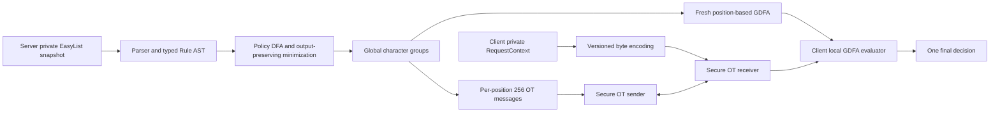

# ZIDS protocol 重建與 EasyList 支援計畫

> Historical plan. Current scope and results are in [implementation status](../../docs/IMPLEMENTATION_STATUS.md). Legacy source paths refer to revision `69a0e63` before cleanup.

更新日期：2026-10-04。依使用者確認，交付限於 EasyList 規則匹配與 OT／GDFA 協定實作，不包含完整瀏覽器行為。

狀態：使用者已授權依序實作並在每一步驗證後自動 commit。先提交本 planning，再執行步驟 1–12。依據 [2026-10-02 審查報告](../audit/paper_conformance_2026-10-02.md) 與本地 ZIDS paper (user-supplied PDF outside this repository)。

**最新範圍決定優先於下文原始最佳化清單。只實作符合 ODFA 所需功能與安全假設的基礎 OT，不實作任何 OT extension。Beaver OT precomputation 與 §6.5 短 key 模式也不列為基礎 OT 交付要求。仍完成 fresh GDFA、離線 garbling、串流儲存、一次性 session 和 EasyList。** 步驟 5 改為基礎 OT 的批次接線，步驟 8 改為 GDFA 串流與離線準備。歷史 Phase 4–5／audit 中提到 extension 的項目標為使用者排除，不宣稱已修復或已實作。原實驗的 O(s) 公開金鑰成本及 XOR-only online OT 不適用本版本。

2026-10-04 補充：第 10 節將工作拆成可依序執行的修改單位，先完成 OT 各層與小型 paper GDFA，再接 EasyList。第 5 節的 Phase 編號是原有工作分類，第 10 節是建議的實際施工順序。

## 1. 目標與完成的定義

目標是讓 EasyList 成為 server 私有 policy 的來源，先編譯成定義清楚的 DFA，再用 paper 的 ODFA protocol 評估 client 的私有請求。EasyList adapter 不得以明文查詢、公開字元分組、公開 rule table 或重用 garbling 來繞過 protocol。

交付分成兩部分：EasyList parser/compiler/matcher，以及支撐 ZIDS 的安全 OT／GDFA 計算流程。以 CLI、函式介面、固定測試資料及兩個獨立程序完成整合驗證。GDFA、字元群組、pad chaining 與一次性 session 仍是必要工作，因為單獨的 OT primitive 不足以實現 paper 的私有 DFA 評估。

**實作路線是重建安全協定核心，再整合經過獨立驗證的 EasyList compiler。** 現有 regex/DFA 的部分演算法可以修正後保留。現有 static encrypted table、HTTP row/col chooser、client master、公開 AID/permutation 及猜測解碼模式，不能延續為正式 protocol。

分別驗收三件事，不把它們混成「可以跑」：

| 驗收軸 | 通過條件 |
| --- | --- |
| Paper protocol | §5 的資料結構、訊息流程、輸出與 leakage 邊界全部對齊，OT/PRG 符合其安全假設 |
| EasyList 語義 | 對宣告支援的 profile，reference engine、plaintext DFA、secure DFA 的結果一致，沒有靜默丟規則 |
| 實驗可重現 | 每次 eval 對應同一個 build 與一次性 session，正確性先通過，再量測明確定義的 offline/online 成本 |

Paper §6 的 server streaming 列入工作。OT extension、Beaver precomputation 和短金鑰最佳化依最新指示排除，正式設定拒絕相應 backend，不能再以同名 stub 代替。使用基礎 OT 保留 paper 的抽象 OT 介面與安全要求，並記錄算法、參數和成本與原始實作的差異。

## 2. EasyList 範圍與不可混淆的界線

使用者已確認範圍為 **EasyList 規則匹配與 OT 實作**。本計畫採用網路請求判斷 profile，輸出 `ALLOW`、`BLOCK`、`NOMATCH`。完整處理此 profile 的 pattern、例外與匹配條件，保留符合 paper 的 GDFA 計算流程。

瀏覽器擴充、DOM/CSS 元素隱藏、scriptlet、CSP 注入、rewrite、header 修改、頁面生命週期、實際網路攔截與代理服務都不在交付範圍，也不列為後续必做階段。輸出 BLOCK 是匹配判斷，不會真的發送或阻止該 URL 的 HTTP 請求。規則分類依 [ABP 官方語法說明](https://help.adblockplus.org/adblock-plus-help-center/how-to-write-filters) 及 [官方速查](https://adblockplus.org/filter-cheatsheet)。

### 2.1 支援矩陣

| 類別 | 主交付目標 | 處理方式 |
| --- | --- | --- |
| 一般 URL pattern、domain anchor、起迄 anchor、wildcard、separator | 必須支援 | 用 AST 編譯正確語言，不做破壞性字串替換 |
| Blocking 與 `@@` exception | 必須支援 | 保留 action 和條件，整合到 DFA 最終輸出 |
| 資源類型及其否定條件 | 必須支援 | 以有版本的 request context 編碼，與 URL 條件相交 |
| domain include/exclude、first/third-party、match-case | 必須支援 | 同一份 context/URL 規範供 reference 與 compiler 使用 |
| 影響匹配結果的 document allowlisting / generic-block policy | 在給定 context 上正確判斷，若出現在目標 snapshot | document/ancestor context 由呼叫端或 fixture 提供，不實作瀏覽器頁面狀態管理 |
| `/regex/` 的 regular-language 語法 | 必須按相容矩陣處理 | 支援的結構精確編譯，不支援的結構以來源行報錯 |
| Backreference 等不能一般性轉成 DFA 的語法 | 不能假裝支援 | 先調查目標 snapshot。若存在，保留為明確的 profile coverage 缺口，不能以 Python regex fallback 通過 secure mode |
| CSP、rewrite、header mutation 等具有額外動作的規則 | 範圍外 | 辨識類別，保留原文與排除原因，不實作動作、不將其改成普通 BLOCK |
| Cosmetic、CSS、DOM、scriptlet | 範圍外 | 辨識規則類別，不建 CSS/DOM parser 或執行器，不送進 network DFA |
| 未知 option 或新語法 | 不允許靜默忽略 | profile compilation 失敗並列出 rule ID、行號、原因 |

規則覆蓋報告分開記錄 `supported`、`out_of_scope`、`unsupported` 與 `invalid`。已確認排除的瀏覽器功能屬於 out_of_scope，不是待實作缺口。匹配 profile 內尚未支援的規則屬於 unsupported，不得靜默略過。預定提供 `--require-profile-coverage`，有 unsupported 或 invalid 就使該 profile 的 build 失敗。說明文件需列出 profile 名稱、snapshot、涵蓋數量與排除原因。

### 2.2 本地資料基線

規劃使用現有 `rules/easylist.txt` 作為第一份固定 snapshot，不在測試中自動下載最新版。

```text
SHA256 = 2888c230ef758e3c5c73a867376ed379d12cd2e9d9b94551634fc60dc1a05f34
Size   = 1,837,766 bytes
```

2026-10-03 規劃時的初步字面分類得到 47,319 條 network candidates、23,648 條 cosmetic candidates，以及 299 行空白或 metadata。它不是正式 parser 的有效規則統計。粗略 option 掃描已看到 document、popup、domain、third-party、CSP 和 rewrite，正式統計須依上述範圍區分匹配條件與範圍外動作。

正式 parser 必須產生逐行 coverage report，區分 metadata、有效且支援、語法錯誤、非本 profile、未支援 feature。這份報告留在 server 或受信任的測試環境，不作為 client 可下載的 policy 資訊。

### 2.3 最小可交付的使用流程

1. Server CLI 讀取 EasyList 檔，輸出 coverage report 和私有 compiled policy。
2. Server 準備指定 n 的新鮮 GDFA 與 matching OT materials，client/server 以兩個獨立程序連線。
3. Client CLI 從 JSONL 或函式參數讀取 URL、resource type、document URL 和必要 context，編碼成私有 X。
4. 雙方執行 OT，client 在本地評估 GDFA，輸出一個 ALLOW/BLOCK/NOMATCH。
5. 測試工具在受信任環境對照 reference matcher 和 plaintext DFA，benchmark 記錄正確性與各階段成本。

執行此流程不需要安裝或啟動瀏覽器，也不需要真的存取 fixture 內的 URL。Reference 使用匹配函式庫和離線資料。CLI/JSONL 的 context 欄位與缺值處理在 Phase 1 固定，缺少必要資料不能悄悄把條件改成無限制。

## 3. 目標架構



三個邊界必須固定：

1. **Compiler 邊界**：EasyList AST、rule IDs、群組成員、transition table、accept/output map 都在 server。Client 不需要知道規則如何分组。
2. **Protocol 邊界**：client 按 input position 和 byte 建 OT query。Server 不收到目前 state、column、URL 或條件判斷結果。
3. **Application 邊界**：client 取得最終 decision。一般模式不輸出每個 prefix 的 ID、不取得各子規則結果，也不把 decision 或解碼失敗位置回傳 server。

Reference engine 只用於受信任的離線測試，不能成為 client online fallback。

## 4. 必须先寫定的 protocol 規格

### 4.1 私有輸入、公開資訊與輸出

| 角色 | 資料 |
| --- | --- |
| Server private | 規則文字、AST、DFA、global groups、各 state partitions、output map、permutations、pads、group keys、OT sender state |
| Client private | 完整 RequestContext、編碼後 X、各位置的 OT choice 與 receiver state |
| Agreed public | protocol/profile 版本、alphabet 256、n、Q、outmax、cmax、安全參數、OT suite、公開的有限輸出 alphabet |
| Client 最終得到 | 主 profile 的一個 ALLOW/BLOCK/NOMATCH label，及協定本來允許的 public parameters |

Session ID 用隨機不透明識別碼。**不要把 rules hash、群組數 C、逐 state degree、rule count、acceptance map 或 rule diagnostics 加進 public manifest。** 私有 policy 的 hash 也可能讓 client 辨認或猜測規則集合，不能因為它叫 provenance 就直接公開。Ciphertext digest 可以公開，因為其對應資料本來就已傳送。

Paper 保護的是 client 提供的輸入，不驗證它一定來自真實瀏覽器流量。Client 偽造 type、document URL 或 third-party context 屬於選擇不同私有輸入，不能誤稱這個 protocol 提供流量來源認證。

### 4.2 RequestContext 與編碼

建立唯一的 `RequestContext`，至少包含 request URL、resource type、document URL。這些資料由 CLI、JSONL fixture 或函式呼叫提供。依 profile 加上必要的 ancestor context 和公開規範下可由 client 計算的 party 資訊，不做 browser instrumentation 或頁面生命週期追蹤。未知或缺失欄位使用明確的狀態值，不默認成有利於某個 verdict 的值。

編碼採有版本、field tag、escaping 與明確結束符的 byte stream，alphabet 保持 256。要求如下：

- URL 的 scheme、path、query case 與必要分隔資訊保留。Host/IDNA/port/percent-encoding 依固定的 URL 規範處理，不能任意把整個 URL lower-case。
- Field separator、escape byte、EOS 不能由 URL 內容偽造。Literal、character class、wildcard 與 anchor 要針對這個編碼編譯，不把 ABP separator 硬換成某個字元而丟失原始資料。
- `^`、`$` 和 search 的起迄語義以邏輯欄位邊界為準，不能誤作用於整段 metadata。
- 以固定版本的 Public Suffix List 與 reference engine 行為定義 party，不允許 online 隱式抓取新資料。
- n 是**編碼後 bytes 長度**。公開 n 符合基本 protocol。可選的 length bucket 必須使用無語義的 EOS 後 padding，另外測試，不能把超長請求截斷。
- 主 profile 的合法編碼至少一個 byte。Generic ODFA 對 n=0 的處理要另列明確規格，不能意外把整張初始 output map 傳出去。

資料欄位到單一字串的轉換是 application encoding，不改變 ODFA 的基本介面。前提是編碼及 compiler 對所有合法輸入有同一個精確定義。

### 4.3 Global character groups

對每個 state q 與 destination t，計算非空集合 `G(q,t) = {x : delta(q,x)=t}`。對這些 256-bit bitsets 全域去重，形成 C。再建立 server-private 的 `C_x = {G in C : x in G}`。

```text
outmax = max over q of number of outgoing groups at q
cmax   = max over x of size(C_x)
```

這兩個參數由 DFA 實算。使用者指定的 padding bound 只能大於或等於實際值，不能用 CLI 強迫 cmax=1，也不能限制 cmax 必須小於 alphabet 大小。

### 4.4 GDFA 格式與 evaluator

令 `b = ceil(log2 Q)`，一般情況 `kprime = 2k + b`。先對 Q 的退化情況、final labels 的編碼範圍以及 byte alignment 明確定義，必要時加入等價 dummy states，不能由某個 decoder 自行猜格式。

每次 session 產生：

- 每個 input position i 的 state permutation pi_i，只有起始 permuted index 公開。
- 每個 position/group 的獨立 group key `K[i,G]`。
- 每個 position/state 的 k-bit pad `P[i,j]`。
- 對非最後位置，明文 entry 為 next permuted index、next pad、k 個 zero bits。
- 最後位置使用 paper 的 terminal-output layout，將 policy decision 編碼成最終 output，不繼續鏈結。
- 每個 real entry 用正確 group key 遮罩，補到 outmax 的 dummy entries 是隨機字串，entry 順序獨立打亂。
- 對整個 cell 做 `PRG(P[i,j])` outer masking。

明確固定 pi 的正反方向、PAD 的索引空間和 cell shuffle 的實作方式。使用獨立 buffer 或安全的排列操作，避免照抄 paper pseudocode 的 in-place 索引筆誤。

Client 每個位置只用當前 pad 打開一個 cell，再以 OT 得到的 cmax keys 嘗試其中 entries。驗證零尾端、索引範圍、長度與 terminal format。沒有候選或有歧義時在本地失敗，不做 endian、key domain 或 GK index 的 fallback 猜測。

走完 n 個位置後才輸出。Client 只需要完整 GDFA ciphertext、OT 的 selected messages 與初始 index/pad，不再載入 row_alph、row_aids、全域 permutation 或 master。

### 4.5 OT contract 與安全模型

對每個位置 i，server 有 256 個等長 messages。Byte x 對應的 message 包含 `C_x` 的 group keys，依 paper 排列及隨機補到 cmax。Client choice 是 `X[i]`，只取得對應 message。Batching 不能改成按已到訪 DFA states 詢問。

原有 DDH/1-of-m 的已知不安全實作僅保留為歷史反例 fixture，正式模式禁止匯入。兩方 backend 要在不同程序、不同私有檔案根目錄運作，不能把 sender service 物件交給 receiver。

建議先做 native OT backend 的可行性驗證，Python 保留 orchestration 和規則編譯。候選是固定版本的 libOTe 加上受檢視的 chosen-message 1-of-256 adapter。官方將 IKNP 列在 semi-honest extension，並另外列出 malicious extension，不能只根據「用了 IKNP」宣稱符合 paper §5.6。[libOTe 官方文件](https://github.com/osu-crypto/libOTe)

Backend 選定前必須逐項記錄 base OT、extension、1-of-256 reduction、long-message transfer 的安全模型及組合理由。需要足以維持 paper 對惡意 client 的 full security，以及對惡意 server 的 client privacy。單純把 8 個安全 bit OTs 用目前的 XOR reduction 拼起來仍然不安全。

若實作歷史 Naor–Pinkas/P-192/IKNP 設定作研究對照，標明歷史參數及實際安全模型。正式安全模式使用滿足目標假設的 suite，不把測試用 ideal OT、direct 模擬或較弱 profile 靜默升級成 secure label。較新的 OT extension 也需要檢查修正版和具體假設，參考 [OT extension 研究原文](https://eprint.iacr.org/2016/602)。

對 §5.5 的 round complexity 另外驗收。基本流程、OT setup/extension、offline precomputation 與 online correction 的輪數分開記錄。若選定的安全 backend 增加輪數，必須把該差異寫入 suite 規格和 benchmark，不沿用 paper 的一輪敘述。任意多輪 OT 不能僅因 function signature 一樣就被視為原始訊息排程的等價實作。

### 4.6 Offline、online 與一次性 session

Reusable compilation artifact 和 one-time garbling artifact 分開：

```text
PRIVATE COMPILED POLICY
  EasyList -> AST -> DFA -> global groups
  可在 policy 未變時重用

ONE-TIME SESSION
  Fresh permutations + pads + group keys
  Fresh GDFA + matching OT materials
  One input string -> one final result
```

Session lifecycle 使用 `CREATED -> PREPARED -> RESERVED -> CONSUMED`，abort 進入 `BURNED`。開始 online choice 後不能把 material 放回 pool，crash/retry 不得讓第二個 input 使用同一組 keys。傳輸重送只能重送同一 transcript 已固定的 bytes，不能接受同 session 的新 choice。

OT precomputation 可以用不知道實際 input 的 random choices，online 再做正確 correction。它和 GDFA 的 position/key table 必須綁定。不能把 warm GK cache 當成 precomputation。底層允許的長期 base state 重用範圍由選定 backend 的規格決定，不能重用已消耗的 random-OT records。

## 5. 分階段實作與驗收

### Phase 0：凍結契約與建立工作基線

工作：

1. 保存现有 audit、rules、產物和歷史 CSV，建立 v2 output namespace。
2. 寫 `protocol_spec.md`、`easylist_profile.md`、wire format 及 threat-model checklist。
3. 把 25 組 audit 問題列入追蹤表，不以重新命名檔案當作修復。
4. 選定 reference 匹配函式庫的固定 commit/版本，記錄依賴和平台。優先用官方 Adblock Plus core 的匹配行為與離線測試作為語義基準，不引入瀏覽器執行環境。[官方 core repository](https://github.com/adblockplus/adblockpluscore)
5. 先完成 native OT 的 Windows/Linux build spike 與兩程序最小 transfer，確認工具鏈、bindings 和選定 suite 的 API 可用。

驗收：有逐項可測的功能與 leakage 契約，profile boundary 沒有歧義，依賴可固定，OT library 可用性與完整安全 composition 審查分開記錄。沒有證明的 backend 性質明確標記為尚待完成，不能往後當作已通過。

### Phase 1：EasyList parser、metadata 與唯一 request encoding

工作：

1. 用 typed AST 取代 escape/replace 型 loader。保留原文、來源檔、行號、stable rule ID、action、pattern、options 和適用條件。
2. Rule ID 不隨 prefilter 或多檔合併重新編號。相同語義的去重保留所有來源，來源對應只在 server。
3. 完成 RequestContext codec，兩條現有 normalizer 不再各自決定不同表示。
4. 建 coverage report，已知瀏覽器動作記為 out_of_scope，匹配 profile 中的未知 syntax/option 記為 unsupported 或 invalid 並報錯。不編譯或執行範圍外規則，也不要求補齊其瀏覽器行為。
5. 建立離線 reference oracle，fixtures 同時保存 request context 與預期 decision，不能只存 URL。

驗收：domain、wildcard、anchor、separator、case、ports、type、domain exclusion、party、exception、document context 均有 oracle cases。編碼能處理 literal control bytes、IDNA、IPv6 與 field-boundary 注入。原 audit 的 raw URL 命中但 encoded URL 不命中反例已變成 regression case。

### Phase 2：正確的 policy DFA、global groups 與資源預估

工作：

1. 明定 regex 支援矩陣，修正 exact repeat、negated class case folding、escape、anchors、search semantics 與不合法語法拒絕。
2. 以 AST 建 NFA/DFA，不用刪 inline flags 的 sanitizer 改寫語義。URL pattern 和 request-context 條件做語言交集，例外優先規則做最終 output policy。
3. 多規則合併時保留足夠資訊，到最後再投影為 decision。不能 `min(rule_id)`，也不能讓 client 分別得到 block/allow DFAs 的結果再判斷。
4. Minimization 按可觀察的最終 output 等價類分割。相同 continuation 但不同 decision 的 states 不可合併。
5. 建立 global group catalog 和 C_x，計算 Q、outmax、cmax。
6. 在 garbling 前估算 matrix、OT payload、offline storage 與 memory，設置明確資源上限。超限回傳 build failure，不暗中減規則或改變 n。

驗收：小 alphabet 的短輸入可 exhaustive 比對 oracle、DFA 和最小化後 DFA。真實 profile fixtures 與 randomized cases decision 全一致。Pattern `ab` 的 cmax regression 不再回傳錯誤的 1。Unknown rules、unsupported regex 與超限 compile 都有獨立診斷，不混成 NOMATCH。

### Phase 3：重建 paper GDFA 和本地 evaluator

工作：

1. 實作 n × Q × outmax 结构與唯一 bit codec。
2. 實作 per-position permutation、group keys、pad chaining、inner/outer masking、dummy entries、shuffle 和 terminal output。
3. 將 paper 每一步對應到具體函式與 invariant，建立小型 known-answer vectors。
4. 初期可在 tests 使用明確標記的 ideal OT，只測 garbling 正確性。正式 CLI 永遠不能選到 ideal OT。
5. Evaluator 接口只收 GDFA、selected key bundles、initial index/pad，不收 server-private tables。

驗收：n=1、不同 Q bit widths、非 identity permutations、cmax>1、outmax padding、block/allow overlap、malformed entries 都有測試。明文 policy DFA 与 garbled 結果一致。Wrong-key probe 不會因 next-row 恰好在範圍內就通過，zero-tail 誤接受機率按 n/outmax/cmax 的 union bound 記錄，不能用少數測試宣稱絕對為零。

### Phase 4：接通真正 OT 並關閉所有替身捷徑

工作：

1. 完成滿足指定安全模型的 base OT、extension 和 chosen-message 1-of-256 composition。
2. 兩方網路 API 傳 cryptographic messages，不傳 raw choice、row、col、master 或目前 state。
3. Transcript/PRG/KDF domain 綁定 suite、session、batch、position、message role。Sender 和 receiver 的索引規範一致。
4. 驗證群元素、key sizes、消息長度、suite/version 和 batch 狀態，任何不支援 backend 明確失敗。
5. 把 audit 的 XOR relation 與 malicious A=p−1 攻擊移入 regression suite，另外測試多 session/batch/domain 的隔離。

驗收：真實分離程序完成 256 種 choice 的功能 cases，已知 privacy 反例無法成立。接收方 process 不具備 sender key files/service instance。完成書面的安全 assumption/composition review，不以 functional tests 取代安全論證。

### Phase 5：補齊 paper 的效率機制

| 機制 | 必須實作的行為 | 驗收 |
| --- | --- | --- |
| 1-of-256 reduction | 有安全依据的 byte-choice 到底層 OT 組合，或滿足相同介面的安全 1-of-N backend | 正常 choice 正確，未選 messages 不出現已知線性洩漏 |
| OT extension | 真正降低大量 base public-key operations，不是 DirectOT wrapper | backend counters、base OT 次數與 extension batch 量可觀察於測試環境 |
| OT precomputation | input-independent material 在 offline 產生，online 只作選定 construction 的 correction | offline/online transcript 清楚分離，materials 一次性使用 |
| Server streaming | 一次產生一個 input-position 的矩陣列，再寫出/傳送 | 固定 DFA 時，server garbling working memory 不隨 n 線性增加 |
| Client matrix storage | 完整預取或本地磁碟/mmap 存放 | evaluator 不依 path 向 server request cells |
| §6.5 短 key 模式 | offline 預送 256 個等長 bundle ciphertexts，online OT 選短 wrapping key，再本地還原長 bundle | 與基本模式結果一致，nonce/domain/一次性 keys 正確，online bytes 實際降低 |

Streaming 允許保留下一列所需的 pad/permutation 等生成狀態，不允許先 `list(all_rows)`。OT payload 的 offline 準備也要採 bounded-memory pipeline，不能只修 GDFA writer 而把全部 n-position OT tables 累積到 RAM。

短 key 模式的 cipher suite、固定長度與驗證方式另寫成 protocol profile，需分析其對既有 proof assumptions 的影響。不能只把長 key 截斷。初版基本 protocol 可以先驗收，但要完成「含 paper 最佳化」的交付，這一階段不可略過。

### Phase 6：Session、artifact 格式與 client/server 隔離

工作：

1. 將 compiled policy、server-only one-time secrets、client-visible ciphertext bundle 分成不同路徑與 schema。
2. Public header 只含已允許的參數與 ciphertext framing。完整 rules/build provenance 放 private manifest。
3. Private manifest 綁定 source snapshot、compiler version、encoding/profile、DFA/group digest、suite、n、session 和所有 artifact digests。
4. 建立 atomic session reservation、consume/burn、crash recovery 及固定 transcript 的安全重送。
5. Client 初始化不讀 row_alph、row_aids、permutation 或 master，移除 static GK cache。
6. 格式不匹配、sidecar 缺失、錯 suite、錯 session 一律明確失敗，不猜布局、不跨 build 補資料。

驗收：兩個 session 即使輸入相同，garbling/key material 仍不同。第二次以新 input 使用同一 session 失敗。新 policy 不能套舊 session。Client 可存取的目錄與完整 wire capture 均不包含 private policy fields。

### Phase 7：端到端整合、舊入口淘汰與平台驗證

工作：

1. 正式 `engine` 只保留 protocol v2 的單一路徑。旧 chooser、old evaluator、broken scripts 不再出現在正式設定範本。
2. `build -> prepare session -> evaluate -> verify` 使用同一 build handle。Benchmark 不再 build A、eval B。
3. 將原有有用的 functional tests 搬到可正常執行的 test suite，補足空白 integration tests。
4. 在 tests 中使用 fixed synthetic keys 產生可重現 vectors，正式模式使用安全 randomness，兩者在 API 與設定上隔離。
5. 定義 Linux 與 Windows 的同一組支援工具鏈，原生 backend、Python dependencies、reference engine 版本都 lock。舊 `.venv` 追蹤清理另作獨立變更，不把使用者環境刪除混入 protocol 改寫。

驗收：乾淨環境可依 README 透過 CLI 跑完整的小型例子，不依賴瀏覽器或實際 URL 存取。兩方程序從真實 EasyList fixture 到最終 decision 全通，所有公開入口的 output/ID/unknown-field 行為一致。錯誤不會把 client input、local path state 或解碼失敗位置回傳給 server。

### Phase 8：擴大 EasyList 與重做 benchmark

順序為 synthetic rules、`rules/small.abp`、具正負例和 context 的 200-rule fixture、2,000-rule profile，最後才是固定 full snapshot 的目標 network profile。

每次擴大均先完成 syntax coverage、reference equivalence、state-size forecast 和 resource checks。不能因為 200-rule case 跑通，就把所有 EasyList rule syntax 標成支援。

分開記錄：

- Compile、minimize、global grouping。
- Offline garbling、ciphertext transfer、OT setup/extension/precomputation。
- Online correction/OT message exchange、client local evaluation、單 request end-to-end。
- Client/server CPU、peak working memory、磁碟、實際雙向 wire bytes 與各階段通信輪數。
- Cold initialization 與可重用 compiled-policy 初始化成本。

每次 timing 都建立 fresh one-time session。Warmup 消耗另外的 sessions，不能暖 key cache 後重用它。比較「是否做 offline precomputation」時，只改該因素，不同 n、Q、profile、OT suite 不混算。Regex/reference 時間獨立報告，不加進 protocol online latency。

驗收：每筆 request 有 ground truth，全部先經過正確性檢查。保留完整 raw records、版本及參數，結果寫新目錄。失敗、超限及 unsupported coverage 也要記錄，不能只保留成功 run。

## 6. 檔案修改對照

以下是預定位置，可以在 Phase 0 統一命名，但責任邊界不能再交叉。

| 現有路徑或新增模組 | 修改方式 | 階段 |
| --- | --- | --- |
| `src/server/io/easylist_loader.py`、`rule_loader.py` | 改為 typed parser 與 stable source provenance，不丟 action/options | 1 |
| 新 `src/common/easylist/` | RequestContext、profile types、唯一 byte codec，沒有 server 私有規則資料 | 1 |
| 新 `src/server/easylist/` | AST validation、policy compiler、server-only coverage report | 1–2 |
| `common/abp_canonicalize.py`、`urlnorm.py` | 遷移到同一編碼入口，舊介面最後明確廢止 | 1、7 |
| `rules_to_dfa/regex_to_dfa.py` | 修正支援語法，拒絕未支援結構，補 differential tests | 2 |
| `rules_to_dfa/chain_rules.py`、`dfa_combiner.py` | 保留完整 output policy，統一 flags，確保多程序結果一致 | 2 |
| `dfa_optimizer/char_grouping.py`、`sparsity_analysis.py` | 每 state grouping 加 global catalog/C_x，正確計算 cmax | 2 |
| `common/odfa/matrix.py`、`params.py`、`packing.py`、`permutation.py` | 重新定義 position/state/entry、位元布局、參數約束與無偏 permutation | 3 |
| `server/offline/key_generator.py`、`gdfa_builder.py` | fresh per-session/per-position materials 與完整 paper garbling | 3 |
| `client/online/gdfa_evaluator.py`、`engine.py` | 統一 final-output evaluator，移除 sidecar 與模式猜測 | 3、7 |
| 新 `src/common/ot/backend.py`、`native/ot_backend/` | 分離 sender/receiver API，固定 native suite 與 build | 0、4 |
| `common/ot/ot_1ofm.py`、`ot_1of256.py`、`base_ot2/*` | 以正確 backend/reduction 取代不安全路徑，歷史 code 只留 regression fixture | 4 |
| `client/online/ot_query_builder.py`、`server/online/ot_response_builder.py` | 改成按 input position 的 256-choice OT，不按 DFA row 查 key | 4 |
| 新 OT precomputation / short-key profile 模組 | 真正 offline/online correction 與 §6.5 模式 | 5 |
| `server/offline/export/gdfa_packager.py`、`client/io/gdfa_loader.py` | 新格式與串流寫入，本地 mmap/讀取，無敏感 public sidecar | 5–6 |
| `server/online/session_manager.py`、`handler.py`、`gk_loader.py` | 一次性 material 和 private manifest，停止整列 GK API | 6 |
| `token_http.py`、`chooser_http.py`、`chooser_master.py`、`ot_client.py`、`dev_ot_server.py` | 正式入口禁止依赖，測試替身明確隔離或移除 | 4、7 |
| `client/offline/param_setup.py`、`common/net/messages.py` | 與新 suite/transcript schema 接通，統一匯入與驗證 | 4、6 |
| `tools/build_artifacts.py`、其他 build scripts | 收斂成 compile/prepare 兩個明確入口，停止動態 API 猜測 | 6–7 |
| `tools/run_dfa_with_abp.py`、`eval_urls.py`、`ot_healthcheck.py` | 改成新 lifecycle 與正確 health schema，不把明文 helper 稱作 OT | 7 |
| `tools/export_id_to_action.py` | 不再依原始行數重建 action map，正式 decision 在 server compiler 完成 | 1、7 |
| `tools/bench_all.py`、`bench_zids.py`、`bench_ot.py` | 同 build、fresh session、固定 timing boundaries、有 ground truth | 8 |
| `gen_urls.py`、`src/scripts/easylist_*` | 可重現 fixture generator，oracle 檢查正負例，無 import side effect | 1、8 |
| `src/test/` 或統一後 `tests/` | 真正單元、differential、security regression、兩程序 integration tests | 1–8 |
| `configs/`、README、依賴 lock files | 去除 client master，記錄 profile、suite、paths、完整可執行命令 | 0、7–8 |

## 7. 與 25 組 audit 問題的對照

| 問題 | 關閉條件 | 階段 |
| --- | --- | --- |
| P0-01 GDFA 結構 | position matrix、pad chain、雙層 masking 和 final output 全部實作 | 3 |
| P0-02 明文 OT/全 DFA 解密 | client 無 master/sidecars/all-keys API，只有真 OT selected bundles | 4、6 |
| P0-03 1-of-m 線性洩漏 | 替換 reduction，反例失效並有安全 composition 依据 | 4 |
| P0-04 malicious sender 群攻擊 | 所選 backend 的輸入驗證與安全模型正確，回歸通過 | 4 |
| P1-01 cmax | global C/C_x 實算，含 cmax>1 cases | 2 |
| P1-02 packing | 唯一 bit codec，無 outmax 平方錯誤，長度由參數推導 | 3 |
| P1-03 decoder | encode/decode 一致、檢查尾零、不猜格式 | 3 |
| P1-04 permutation | 每位置新鮮、無偏、秘密、正反 mapping 正確 | 3 |
| P1-05 AID/output | policy-aware minimization，單一 final decision，無公開 AID 表 | 2–3 |
| P1-06 regex | 支援子語法精確，其他明確拒絕，oracle differential 通過 | 1–2 |
| P1-07 payload mismatch | compiler 和 client 共用編碼規範，raw/encoded 等價 | 1–2 |
| P1-08 ABP semantics | profile feature cases、context cases、coverage gates | 1–2、8 |
| P1-09 metadata/ID | stable IDs、完整 action/options、沒有跨入口 policy 差異 | 1–2、7 |
| P1-10 build/eval 分離 | 私有 manifest 綁定完整 build/session，CLI 使用同一 handle | 6–7 |
| P1-11 freshness | one-time state machine、burn/replay protection、無跨輸入 key cache | 5–6 |
| P1-12 benchmark | 正確性 gate、fresh sessions、成本分項與 ground truth | 8 |
| P1-13 失效 APIs | 正式入口全可執行，舊路徑被淘汰或明確標記 | 7 |
| P2-01 memory | writer/OT preparation 有界工作記憶體，client 本地存取 | 5 |
| P2-02 跨檔 binding | private manifest、public framing、版本與 digest 檢查 | 6 |
| P2-03 假 extension | 真實 backend 與實測 counters，precomputation 分界明確 | 4–5 |
| P2-04 設定不生效 | 嚴格 schema，未知欄位拒絕，禁止 fallback | 0、6–7 |
| P2-05 測試缺口 | functional、semantic、adversarial 與 end-to-end 各自存在 | 1–8 |
| P2-06 provenance | snapshot/build/suite/資料標籤與原始結果完整保存 | 0、8 |
| P2-07 generators | deterministic generator 加 oracle 檢查，context 完整 | 1、8 |
| P2-08 repository 混雜 | 清楚分離 legacy、third-party environment、source 和 outputs | 0、7 |

## 8. 測試矩陣與安全驗收

### 8.1 語義測試

每個 supported feature 至少有會命中、不命中、边界與交互作用 cases。額外必測 ALLOW/BLOCK overlap、domain include+exclude、同站/跨站、大小寫、帶 port、空 path、query、escaped separators、URL 中看似 metadata 的 bytes、多個來源檔和 duplicates。

使用三方比較：固定版本 reference engine、server plaintext PolicyDFA、client secure evaluation。Reference 不能重用我們的 parser/converter，否則會共用同一個錯誤。

### 8.2 協定測試

小型 DFA 做 exhaustive input enumeration。完整 alphabet 則測所有 256 個 byte choices 及邊界長度。涵蓋 permutations、terminal row、non-byte-aligned widths、dummy padding、cmax>1、invalid entries、不同 security suites 與短-key模式。

Randomness 可在 tests 注入固定種子作 vectors。正式模式不允許 deterministic test RNG，不對外輸出 secret trace。

### 8.3 安全回歸與隔離

驗證 audit 的兩個 OT 攻擊、離線全表解密、session 重用、換 choice 重送、跨 session/batch key 混用、extra-field 注入與非法群元素。這些是特定漏洞回歸，不等同一般性安全證明。

Wire schema 及不同輸入下的消息數量/大小不能依 DFA path 改變。Client local failure、partial hits、最終 verdict 不應回送成 server 可觀察的選擇性失敗訊號。底層 crypto 的 timing/implementation 假設由 backend security review 記錄。

對 server-private、client-private、public objects 作型別與 serialization 邊界檢查。Debug dumps 只允許在受信任的 tests 或 server-side analysis 使用，正式 client bundle 不含它們。

## 9. 可行性風險與明確停止条件

**符合 paper 可能比目前 static table 消耗更多儲存空間。** 修掉 outmax 平方錯誤之後，還必須補回目前完全缺少的 n 維度。

若每個 cell 對齊 bytes，單純 GDFA ciphertext 大小約為：

```text
n * Q * ceil(outmax * (2k + ceil(log2 Q)) / 8) bytes
```

只拿舊 L128 產物的 Q=25,632、outmax=39 作假設，使用 k=128 時 kprime=271 bits，得到：

| 編碼後 n | GDFA 約略大小 |
| --- | --- |
| 256 bytes | 8.08 GiB |
| 512 bytes | 16.16 GiB |
| 1,024 bytes | 32.32 GiB |

這只是公式估算，不是新 compiler 的測量結果，也不含 OT、header 和 private material。新 EasyList/context DFA 的 Q、outmax、cmax 都可能不同。整份 EasyList 的 DFA state explosion、密文傳輸及一次性 session 成本，是 Phase 2 就必須量測的主要風險。

不能為了通過規模測試而採用下列隱藏變更：

- 多個 inputs 重用同一份 garbling。
- 依 URL 或 DFA path 向 server 選 shard。
- Client 取得每個 shard 的結果後再自己聚合。
- 用 client 明文 regex fallback 處理未支援規則。
- 截斷 URL/context、丟規則或把 unsupported 當 NOMATCH。

這些做法可能改變 privacy functionality、額外 leakage 或輸出。若單一 DFA 超出可行資源，需要另立經安全分析的分區/聚合或其他 2PC 設計，不能標成原 paper protocol 已全部滿足。

停止條件是規格矛盾、backend 安全假設不成立、語義 differential 失敗、或資源超限。它們應產生具體報告與尚未完成狀態，不能以「bench 有跑完」跳過。

## 10. 按 paper 設計修改的實作順序

先讓小型 DFA 的真 OT 與 garbling 正確，再接完整的 EasyList 語義與規模。以下每一步都必須交付程式、對應規格及有意義的驗證結果。每完成一步自動 commit，然後直接進入下一步。只提交該步工作，不混入既有使用者修改與大型 artifacts。

### 10.1 先固定 paper 對應關係

| 層級 | Paper 的設計或實驗配置 | 本專案的修改要求 |
| --- | --- | --- |
| §5.4 ODFA | 每個 input position 執行一次 1-of-256 OT，取得 padded group-key bundle | 保持此功能與資料邊界，不能改回按 state/row 取 key |
| §6.1 的 1-of-256 | Naor–Pinkas [22] 將 n 次 byte OT 化成 8n 次 bit OT | 按引用原文選定具體 reduction，完全取代目前會洩漏 XOR 關係的組合 |
| §6.1 的 base OT | Naor–Pinkas [19] §3.1 amortized OT，原實驗使用 EC P-192 | 先完成可追溯到原文的算法與兩方介面，記錄所選曲線、參數和原實驗的差異 |
| §6.1 的 extension | IKNP [23] 的數量擴展及 Appendix B 的長訊息處理 | 使用者排除，基礎 OT 的公開金鑰工作隨輸入長度增加 |
| §6.1 的 precomputation | Beaver [33] 將昂貴 OT 計算移至 offline | 基礎交付不實作，區分 GDFA offline 和 OT online 成本 |
| §6.5 | Offline 傳長 bundle 的密文，online OT 傳短解密 key | 基礎交付不實作，直接透過 chosen-message OT 傳 bundle |

Paper §5.6 的定理以符合其安全要求的 OT 為前提。重現 §6.1 中某個算法名稱或歷史參數，不能自動代表達成對 malicious client 的 full security 和對 malicious server 的 client privacy。

**保留 paper 的基礎 OT 功能與 NP 路線，具體 suite 在步驟 1 審查後固定。** 核對 [19]、[22] 原文的算法、角色、假設與組合條件。任何曲線及 hash 的替換列入差異表。只接入 base OT，沒有 IKNP、KOS 或其他 extension 的隱含 fallback。

這項審查在寫密碼協定之前完成。不得把「加長 key」「在現有 XOR pad 中加一個 label」或「改用另一條曲線」視為已證明修復整個 construction。

### 10.2 逐步修改、依賴及驗收

表中的檔案以 `src/` 為根目錄，`docs/`、`native/` 和 `tools/` 除外。新位置是預定責任邊界，不表示檔案已存在。

| 步驟 | 要修改的內容與主要檔案 | 完成條件 | 對應原 Phase |
| --- | --- | --- | --- |
| 1. 固定協定與 suite | 新 `docs/protocol_spec.md`、`docs/ot_suite.md`，逐項寫出 paper 算法、輸入輸出、wire transcript、安全參數及歷史差異。保存現有 audit 和產物，建立 v2 namespace | Paper 步驟能對應到函式與測試項目，backend 在 Windows/Linux 的最小 build 已驗證，安全假設沒有未標示的空白 | 0 |
| 2. 分開兩方介面 | 新 `common/ot/backend.py`、`native/ot_backend/`，重做 `common/net/messages.py`。建立 sender-only messages 與 receiver-only choices API、transport framing、session/batch ID 和最小一次性 session 狀態 | 兩個獨立程序可交換 protocol messages，receiver 不拿 sender service、seed pair 或 master。正式 v2 未完成的 backend 明確拒絕執行 | 0、4、6 |
| 3. 替换 base OT | 取代 `common/ot/base_ot2/ddh_ot.py` 的正式路徑，按審查後的 NP amortized construction 實作或接入 backend。群／曲線運算使用經維護的 native library，驗證雙方收到的元素與編碼 | Choice 0/1、批次 transfer、錯誤長度和非法元素 cases 通過，有逐訊息算法對照。舊 `A=p−1` 類攻擊有對應回歸 | 4 |
| 4. 重做 1-of-256 | 重做 `common/ot/ot_1ofm.py`、`ot_1of256.py`，按 [22] 的 reduction 取代 XOR-of-independent-pads。先用步驟 3 的真 bit OT 驗證，固定 byte 的 8-bit 順序 | 全部 256 個 choice 均取得對應等長 message，四密文 XOR 洩漏反例失效，未選訊息的保護有 construction 依據 | 4 |
| 5. 接通批次基礎 OT | 讓步驟 4 經由單一 base OT backend 批次取得 bit OTs，綁定 position/batch/domain，加入 counters，明確拒絕 extension 選項 | 正確執行 8n 個 bit transfers，不聲稱 O(s) 成本。不同 batch/session 隔離，分批與整批結果一致 | 4 |
| 6. 重建 groups 與 codec | 用人工可驗證的小型 DFA 修改 `dfa_optimizer/char_grouping.py`、`sparsity_analysis.py`、`common/odfa/params.py`、`matrix.py`、`packing.py`、`permutation.py`。建立 global C/C_x、實算 cmax/outmax 和唯一 bit layout | `ab` 等 cmax>1 反例正確，非 byte-aligned 欄位可 round-trip，長度公式只有一次 outmax 乘數，permutation 正反方向固定 | 2–3 |
| 7. 重做 GDFA 並接 OT | 改寫 `server/offline/key_generator.py`、`gdfa_builder.py`、`client/online/gdfa_evaluator.py` 及兩方 query/response builders。實作 n×Q×outmax、每位置隨機性、pad chain、雙層 masking、random dummies、shuffle 與 final output | 同一小型 DFA 的 plaintext、ideal-OT test、真 OT 兩程序結果一致。Client 只收 initial state/pad、GDFA 和每位置選中的 bundle | 3–4 |
| 8. GDFA 串流與 offline 準備 | 修改 packager/loader，server 每次生成一個 position row，client 本地儲存完整矩陣。GDFA 與每位置 OT bundles 在 private/public artifact 間正確分離 | 記憶體有界，n 增加不會累積整個矩陣於 server RAM，讀寫結果一致。OT 仍使用基礎協定 | 5–6 |
| 9. 完成 EasyList 語義層 | 重做 `server/io/easylist_loader.py`、`rule_loader.py`，新增 common/server 的 EasyList 模組。固定 AST、context codec、coverage report 和獨立 offline oracle | Anchors、wildcards、separator、exceptions、type/domain/party/match-case 按 profile 正確。缺 context 或 unsupported 語法明確報錯 | 1 |
| 10. 將 EasyList 編入單一 policy DFA | 修正 `regex_to_dfa.py`、`chain_rules.py`、`dfa_combiner.py`、`minimization.py`。保留 ALLOW/BLOCK 優先規則，計算最終 decision，再使用步驟 6–8 | Reference matcher、plaintext DFA、secure evaluator 三方一致。例外不能被 rule ID 大小蓋掉，不向 client 發 rule/action table | 2、7 |
| 11. 完成 lifecycle 與 CLI 切換 | 完成 `server/online/session_manager.py`、private/public artifact schema、`client/online/engine.py`、`tools/`、`configs/` 和 README。加入原子 reservation、consume/burn、crash recovery 與固定 transcript 重送，淘汰 v2 的舊 chooser 入口 | Client config 無 master。無全 key API、無 path-dependent requests、無同 session 換 input。乾淨環境可跑 compile → prepare → evaluate 全流程 | 6–7 |
| 12. 擴大資料與重做 benchmark | 修正 fixture generators、`tools/bench_ot.py`、`bench_zids.py`、`bench_all.py`。從小型 rules 擴至 200、2,000，再到固定 EasyList snapshot 的目標 profile | 每筆先通過正確性比對，每次使用 fresh session。報告 n/Q/outmax/cmax、兩方耗時、記憶體、wire bytes、輪數、coverage 和超限結果 | 8 |

步驟 2 已要求測試中的 session 一次性使用，步驟 11 才補齊持久化與正式 CLI 的完整 lifecycle，不能等整合時才開始隔離 keys。步驟 9 的 parser/oracle 工作可以在 OT backend 尚在建置時先做，但不得先接回目前的 row-key HTTP 路徑。

### 10.3 OT 的實際接線順序

目前 `ot_1ofm.py` 在 chooser 內直接建 `DDHOTSender` 和 `DDHOTReceiver`。正式版本必須隔離兩方角色，改為以下基礎 OT 接線：

```text
ODFA sender: 每個 position 的 256 個等長 key bundles
ODFA receiver: 私有 X[i]
                  ↓
         chosen-message 1-of-256 reduction
                  ↓
         8n 個 bit choices 的批次 OT 介面
                  ↓
         所選 suite 的 base OT
```

這是模組依賴圖，不是 network message 的時間順序。沒有 OT extension 層。

具體順序如下：

1. 用真 base OT 驗證一個 bit 的完整 transfer，再批次驗證。
2. 用這個 bit OT 接上安全的 1-of-256 reduction，先傳獨立的 synthetic messages。
3. 接入批次 base OT provider，驗證實際 transfer 計數與跨 batch 隔離。
4. 將 synthetic messages 換成每位置的 padded C_x group-key bundles，接入小型 GDFA。
5. 加入 GDFA offline streaming 與一次性 session，直接量測基礎 OT 的線性公開金鑰成本。

Base OT 批次化、OT 數量擴展、長訊息處理、offline precomputation 和短 key 模式是不同責任。每一層單獨有參數、測試與 metrics，禁止用同一個 `backend="iknp"` 開關把它們混成已完成。

### 10.4 每個里程碑可以宣稱什麼

| 里程碑 | 可以驗收的結果 | 尚未完成的部分 |
| --- | --- | --- |
| 步驟 1–5 | 有明確 suite 與兩程序隔離的基礎 1-of-256 OT | GDFA、EasyList、offline garbling 尚未整合 |
| 步驟 6–7 | 小型 DFA 按 paper §5 流程完成 oblivious evaluation | 尚不能宣稱支援完整 EasyList 或完成 §6 最佳化 |
| 步驟 8 | 小型 protocol 具有串流 offline GDFA 與基本 online OT | 真實規則語義與規模尚待驗收，OT 最佳化依範圍排除 |
| 步驟 9–11 | 宣告範圍內的 EasyList 與 protocol 完整整合，CLI 可重現 | 全 snapshot coverage、資源上限與量測仍由步驟 12 確認 |
| 步驟 12 | 通過的 profile、資料規模及安全 suite 可依證據報告 | 若超限或存在 profile 內 unsupported，對應完整交付保持未完成 |

每一交付附對應 audit ID、paper 節次、實際測試命令與結果。Security regression 只能驗證已知攻擊，不能代替 OT composition 的安全論證。所有第一版未完成項都留在狀態表，不以測試可執行或命中率相同標為完成。

## 11. 最終 Definition of Done

- [ ] §5 的每一步均可對應到程式、資料格式和測試，沒有測試替身留在正式路徑。
- [ ] OT suite 和所有 reductions/compositions 足以支撐指定安全模型，有書面依據與安全回歸。
- [ ] 基礎 OT 與 GDFA streaming 均驗收，明確排除 extension、Beaver precomputation 和短 key 模式，與歷史配置差異清楚標示。
- [ ] Client 只具有允許的 public material、自己選到的 messages 與最後輸出。
- [ ] 一份 garbling/OT material 僅供一個 input string，異常與 retry 不破壞此約束。
- [ ] EasyList 匹配 profile 的全部功能有精確語義，unsupported 與明確排除的 out_of_scope 分開記錄，沒有靜默吞掉規則。
- [ ] Reference、plaintext DFA、secure evaluator 在完整測試集一致，包含真實 positive、negative、exception 和 context cases。
- [ ] Build、prepare、eval 用同一份私有 provenance，公開 metadata 沒有額外暴露 policy。
- [ ] 在固定 snapshot 和資源上限內完成所宣告規模，未完成 full-profile 時不能宣稱完整 EasyList 支援。
- [ ] Benchmark 正確分隔 offline/online 與初始化，每次 online 使用 fresh session，保留全部原始結果。
- [ ] README 在乾淨 Windows/Linux 支援環境可跑通，所有正式入口及設定 schema 一致。
- [ ] 完整驗收可由 CLI、離線 fixture 與兩方 OT 程序完成，不依賴瀏覽器、DOM 或實際請求攔截。

完成交付的描述為「遵循 ZIDS ODFA protocol 的 EasyList 私有規則匹配實作」。驗收以指定匹配 profile、固定 snapshot、宣告的輸入及資源範圍為準，完整瀏覽器行為不屬於本計畫。
